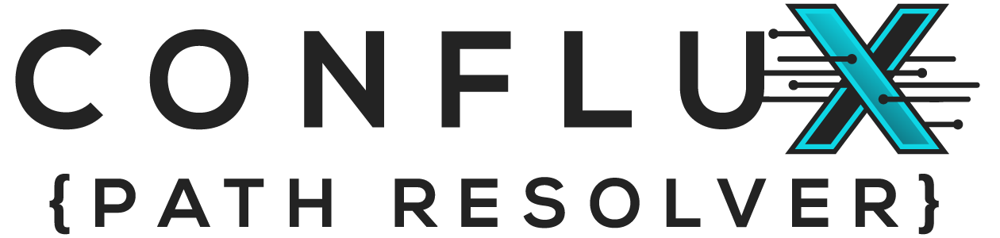

# ConfluxPathResolver


**ConfluxPathResolver** is a powerful and flexible path-resolving library designed for production pipelines.  
It uses YAML-based templates to dynamically resolve filesystem paths using tokenized context.  

### ✨Key Features:
- **Strict and Lazy Resolution**: Choose between strict or partial context resolution.  
- **Wildcard Expansion**: Supports glob-style wildcards in paths.  
- **Environment Variable Interpolation**: Seamlessly integrates environment variables.  
- **Auto Folder Creation**: Automatically creates directories as needed.  
- **Custom Hooks for Extensibility**: Add before/after hooks for validation or modification. 
- **Manual Resolution**: Resolve arbitrary patterns without templates.

Built for production environments, particularly in VFX and animation, it handles complex directory structures and file naming conventions.  
Its extensible design allows users to define custom templates and hooks, making it easy to integrate with existing systems.
---
## 📜 Table of Contents
- [ConfluxPathResolver](#confluxpathresolver)
  - [📜 Table of Contents](#-table-of-contents)
  - [📁 Project Structure](#-project-structure)
  - [🔧 What It Does](#-what-it-does)
  - [🚀 Quick Start](#-quick-start)
    - [1. Setup a Template YAML](#1-setup-a-template-yaml)
    - [2. Load and Resolve](#2-load-and-resolve)
  - [🪝 Hook System](#-hook-system)
  - [🧩 Advanced](#-advanced)
    - [Lazy Mode](#lazy-mode)
    - [Wildcard Matching](#wildcard-matching)
    - [Frame Padding Support](#frame-padding-support)
    - [📂 Template Organization](#template-organization)
    - [🛠️ CLI Example (Optional)](#cli-example-optional)
  - [🧪 Testing](#testing)
    - [Unit Tests](#unit-tests)
    - [License](#license)
    - [Contributing](#contributing)

---

## 📁 Project Structure

```plaintext
conflux_path_resolver/
├── __init__.py # Package initialization
├── context.py # Context class for managing context data
├── resolver.py # Core path resolver logic
├── path_resolver.py # CLI interface for resolving paths
├── template.py # Template class for pattern, defaults, and validation 
├── template_loader.py # Loads YAML-based templates from directories 
├── hooks.py # Hook manager for before/after resolution logic 
├── exceptions.py # Custom exception classes 
├── resolver_utils.py # Token parsing, wildcard, env var expansion helpers 
├── templates/ # YAML files defining path templates 
│   ├── base.yaml # Base templates
│   ├── assets.yaml # Example path templates
│   └── shots.yaml # Example path templates 
├── examples/ 
│   └── # Example usage scripts soon to be added
├── tests/ # Unit tests for the resolver
│   ├── test_resolver.py # Tests for resolver functionality
│   └── test.json # Example test data
├── .gitignore # Git ignore file
├── LICENSE # License file
├── CONTRIBUTING.md # Contribution guidelines
└── README.md # You're here!
```

---

## 🔧 What It Does

ConfluxPathResolver resolves filesystem paths from templates using token-based context like:

```yaml
shot_work_path:
  pattern: "{project_root}/{sequence}/{shot}/{task}/v{version:0>3}/{shot}_{task}.nk"
  defaults:
    version: 1
    task: comp
```
This will resolve to something like:

```
/mnt/projects/dragonfire/SQ001/SH010/comp/v004/SH010_comp.nk
```

## 🚀 Quick Start
### 1. Setup a Template YAML
### templates/shot_templates.yaml
```yaml
shot_output:
  pattern: "{project_root}/{sequence}/{shot}/output/v{version:0>3}/{shot}_{task}.{ext}"
  defaults:
    task: comp
    ext: nk
    version: 1
```

### 2. Load and Resolve

```python
from resolver import PathResolver
from template_loader import TemplateLoader

loader = TemplateLoader(["./templates"])
resolver = PathResolver(loader, strict=True, auto_create_folders=True)

context = {
    "project_root": "/mnt/projects/dragonfire",
    "sequence": "SQ001",
    "shot": "SH010",
    "task": "comp",
    "version": 4,
    "ext": "nk"
}

path = resolver.resolve("shot_output", context)
print("Resolved path:", path)
```

## 🪝 Hook System
Hooks let you validate or modify context before and after path resolution.

### Using the HookManager
``` python
from hooks import HookManager

hook_mgr = HookManager()

def validate_version(context):
    if context["version"] < 1:
        raise ValueError("Version must be >= 1")

hook_mgr.register("before", "shot_output", validate_version)

```
Then During resolution, the hook will be called:
``` python
hook_mgr.run_before("shot_output", context)
path = resolver.resolve("shot_output", context)
hook_mgr.run_after("shot_output", path, context)
```

## 🧩 Advanced
### Lazy Mode
Use `strict=False` to allow partial context resolution:
```python
resolver = PathResolver(loader, strict=False)
```

### Wildcard Matching
Supports glob-style wildcards in resolved paths.
``` yaml
latest_comp:
  pattern: "{project_root}/shots/{sequence}/{shot}/comp/v*/{shot}_comp.nk"

```
### Frame Padding Support
You can use Python formatting for padding:
``` yaml
image_seq:
  pattern: "{project_root}/images/{shot}/{shot}_{frame:04d}.exr"
```
Provide `frame=7` → `SH010_0007.exr`

### 📂 Template Organization
You can group templates per asset type, shot, publish type, etc.
```yaml
asset_work:
  pattern: "{project_root}/assets/{asset_type}/{asset_name}/work/{task}/v{version:03}/{asset_name}_{task}.{ext}"
```
Or split into multiple YAMLs and load via multiple paths in `TemplateLoader`.

### 🛠️ CLI Example (Optional)
```bash
python examples/run_resolver.py \
  --template shot_output \
  --context '{"project_root":"/mnt/projects/dragonfire","sequence":"SQ001","shot":"SH010","task":"comp","version":4,"ext":"nk"}'

```
## 🧪 Testing
### Unit Tests
Run unit tests using pytest:
```bash
pytest tests/
```
Unit tests can be written for:

* Template loading and defaults

* Strict vs lazy behavior

* Hook execution

* Wildcard resolution

### License
This project is licensed under the MIT License. See the [LICENSE](LICENSE) file for details.

### Contributing
Contributions are welcome! Please fork the repository and submit a pull request with your changes.
We appreciate any feedback, bug reports, or feature requests.

Please follow the [Contributing Guidelines](CONTRIBUTING.md) for more details on how to contribute to this project.

For any issues or feature requests, please open an issue in the repository.
